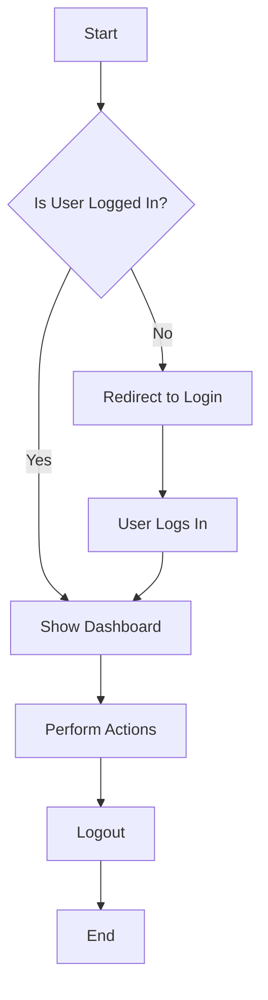

# Sample Markdown Document

This is a simple example of a Markdown file with a table and a Mermaid flowchart.

---

## 📊 Sample Table

| ID | Name        | Role            | Status   |
|----|-------------|-----------------|----------|
| 1  | Ahmad       | Chief Specialist| Active   |
| 2  | Sara        | Developer       | Active   |
| 3  | John        | Designer        | Inactive |

---

## 🔄 Process Flow (Mermaid)

